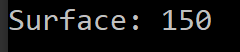

<h1>First Java's project to introduce basics notions of OOP</h1>

In this project, we introduce the main notions of the OOP such as: <b> Class, Object, attributes, methods.</b>

We present how to create a class with properties and how to implement methods of the class. 

We also show how to implement particular methods like <b>Getters </b> and <b> Setters </b> and key words like: <b> static </b> and <b> final </b> 

We finally show how to use visibilities of properties like: <b>public, privaty, protected </b> and <b> default. </b> 

To download this project, you have to enter this command in your git bash prompt:
<code>https://github.com/JuniorSIEMBE/projet1-Java.git</code>

To run the code you have two options:
<ol>
    <li>Use an EDI like Eclipse, IntellIJ and so one and run this code</li>
    <li>Use a command prompt and enter the following command: 
    <ol>
        <li><code>javac -d target\classes src\cm\ime\projet\api\Rectabgle.java</code></li>
        <li><code>javac -d target\classes src\cm\ime\projet\test\TestRectangle.java</code></li>
        <li><code>java -cp target\classes cm.ime.projet.test.TestRectangle 10 15</code></li>
    </ol>
    </li>
</ol>

After running, you are suppose to get this result:

</img>
<h3>Thank you and good luck!</h3>